# Module 1 — API Setup and Secure Integration

**Course:** Building with Claude (StackRoute | RPS Consulting, an NIIT venture)
**Module duration:** 2 hours · **Audience:** Software/application developers, data engineers, solution architects
**Hands-on artifact:** `day1/secure_call.py` · `day1/lab1.md`

> This guide is a self-paced companion to the live-connect session. It starts with the generative
> AI/LLM fundamentals you need as background, places Claude in context within the wider Anthropic
> stack, then walks through every Module 1 topic from the course design: **Anthropic API access,
> SDK setup, key and secret handling, request/response structure, error handling, and cost and
> usage awareness.**

---

## Table of contents

1. [Part A — Generative AI & LLM Primer](#part-a--generative-ai--llm-primer)
2. [Part B — The Anthropic Stack](#part-b--the-anthropic-stack)
3. [Part C — Module 1: API Setup and Secure Integration](#part-c--module-1-api-setup-and-secure-integration)
   1. [Anthropic API access](#1-anthropic-api-access)
   2. [SDK setup](#2-sdk-setup)
   3. [Key and secret handling](#3-key-and-secret-handling)
   4. [Request/response structure](#4-requestresponse-structure)
   5. [Error handling](#5-error-handling)
   6. [Cost and usage awareness](#6-cost-and-usage-awareness)
4. [Annotated walkthrough: `secure_call.py`](#annotated-walkthrough-secure_callpy)
5. [Common pitfalls](#common-pitfalls)
6. [Cheat sheet](#cheat-sheet)
7. [Where Module 1 fits in the course](#where-module-1-fits-in-the-course)

---

## Part A — Generative AI & LLM Primer

### A.1 What is generative AI?

Generative AI describes models that **produce new content** — text, code, images, audio — rather
than just classifying or scoring existing content. A **Large Language Model (LLM)** is the
text-generating member of that family: a neural network trained on huge amounts of text that
learns statistical patterns of language well enough to produce coherent, contextually relevant
text of its own.

Claude, the model family this course builds on, is an LLM created by Anthropic and made available
as a hosted service through the **Claude API**.

### A.2 How an LLM turns your prompt into a reply

At inference time, everything an LLM does boils down to one repeated operation: given the tokens
seen so far, predict the most likely next token, append it, and repeat until a stop condition is
reached.

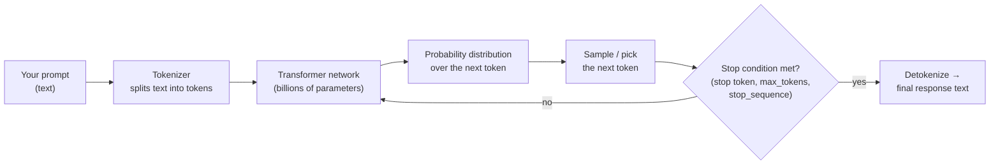

Two ideas from this loop matter immediately for how you'll write code in this course:

- **Everything is measured in tokens**, not characters or words — pricing, context limits, and
  truncation all key off token counts (see [§6](#6-cost-and-usage-awareness)).
- **Generation stops for a reason**, and the API tells you why via `stop_reason` (natural end,
  hit `max_tokens`, hit a `stop_sequence`, or asked to use a tool) — you must check it before
  trusting the output (see [§4](#4-requestresponse-structure)).

### A.3 Pretraining vs. what you do as a developer

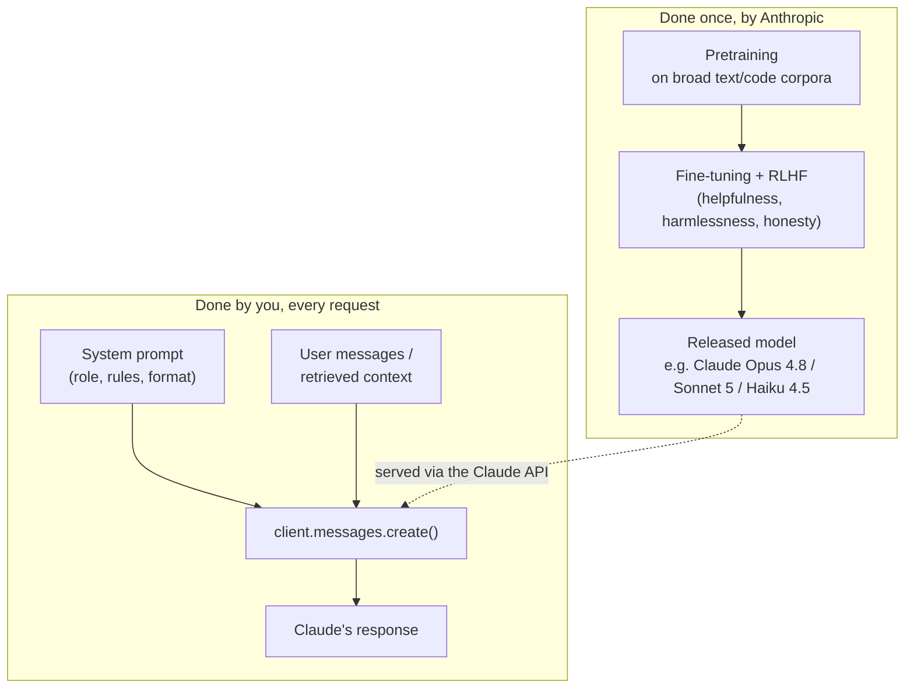

You never train or fine-tune the model in this course. Every technique you learn — prompting,
structured output, tool use, RAG, evaluation — is about **shaping what goes into the request and
validating what comes out**, not changing the model's weights.

### A.4 The application-pattern ladder

This course is structured as an increasingly capable set of patterns layered on the same core API
call. Module 1 gives you the foundation everything else sits on:

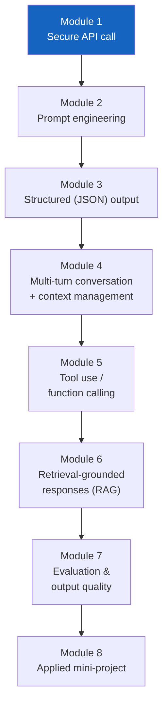

Nothing in Modules 2–8 works reliably without Module 1's habits: a client built from environment
variables, checked `stop_reason`, typed error handling, and token/cost awareness on every call.

---

## Part B — The Anthropic Stack

### B.1 The pieces you'll touch

| Layer | What it is | What you use it for in this course |
|---|---|---|
| **Claude (the model)** | The LLM itself — a family of models (Opus, Sonnet, Haiku) at different capability/cost/latency points | Chosen per call via the `model=` parameter |
| **Claude API** | Anthropic's HTTPS REST API (`api.anthropic.com`) that serves inference requests | The wire protocol every SDK call ultimately becomes |
| **Python SDK (`anthropic` package)** | The official client library that wraps the REST API in typed Python objects, retries, and streaming helpers | What you actually import and call — `anthropic.Anthropic()`, `client.messages.create()` |
| **Anthropic Console** | Web UI at [console.anthropic.com](https://console.anthropic.com) | Creating your API key, viewing usage/billing, a prompt playground |
| **`.env` / environment** | Your machine's environment variables, loaded via `python-dotenv` | Where `ANTHROPIC_API_KEY` lives — never in source code |

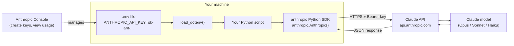

### B.2 Model family used in this course

The course's [version & currency policy](../README.md#version--currency-policy) pins these
conventions. You'll see all three model names across the labs, chosen for cost/latency/capability
trade-offs, not interchangeably:

| Model ID | Role in this course | Why |
|---|---|---|
| `claude-haiku-4-5` | Default in Day 1 labs (`secure_call.py`, `starter.py`) | Fastest, cheapest — good for learning the mechanics of a call without burning budget |
| `claude-sonnet-4-6` | Default from Day 2 onward (`ANTHROPIC_MODEL` env var) | Balanced quality/cost for tool use, RAG, multi-turn work |
| `claude-opus-4-8` | Course-wide recommended default for complex reasoning | 1M context, highest capability — used when a task genuinely needs it |

> **Always verify current model IDs and pricing against
> [platform.claude.com/docs](https://platform.claude.com/docs)** or `client.models.list()` before
> teaching or shipping — model names and prices are the fastest-moving part of this material.

### B.3 What the SDK gives you beyond raw HTTP

You *could* call the REST API with `requests` and hand-craft JSON — the SDK exists so you don't
have to:

- Typed request/response objects (`response.content`, `response.usage`, …) instead of raw dicts
- Automatic retries with backoff on transient errors
- A typed exception hierarchy (`AuthenticationError`, `RateLimitError`, …) instead of parsing HTTP
  status codes yourself
- Helpers like `count_tokens()`, `messages.parse()`, `messages.stream()`, and the beta
  `tool_runner()` that you'll use from Module 3 onward

---

## Part C — Module 1: API Setup and Secure Integration

**Course design table (verbatim scope for this module):**

> Anthropic API access, SDK setup, key and secret handling, request/response structure, error
> handling, and cost and usage awareness.
> **Hands-on:** Build a Python script that calls Claude securely using environment-managed
> credentials.
> **Tools:** Anthropic Python SDK; environment management.

By the end of this module you can:

- [ ] Obtain and store an Anthropic API key without ever putting it in source code
- [ ] Install and initialise the Python SDK correctly
- [ ] Explain the anatomy of a `messages.create()` request and its response
- [ ] Handle the four core SDK exception types correctly
- [ ] Estimate token cost before a call and read actual usage after one

---

### 1. Anthropic API access

Getting from "no account" to "a working key" is a one-time setup:

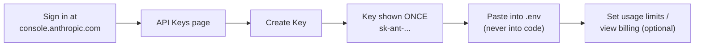

Key facts worth internalising, not just steps to click through:

- A key is shown **once** at creation time — if you lose it, you revoke and create a new one, you
  cannot retrieve the old value.
- Keys are scoped to a workspace/organization in the Console and can be individually revoked —
  treat a leaked key as compromised immediately and rotate it (see [§3](#3-key-and-secret-handling)).
- The Console also shows **usage and billing** — the same dashboard you'll use in
  [§6](#6-cost-and-usage-awareness) to sanity-check the cost estimates your code prints.

---

### 2. SDK setup

Two packages are all Module 1 needs (the fuller `shared/requirements.txt` adds `pydantic`,
`openai`, and `numpy` for later modules):

```bash
python3 -m venv .venv
source .venv/bin/activate          # Windows: .venv\Scripts\activate.bat

pip install anthropic python-dotenv
```

| Package | Purpose |
|---|---|
| `anthropic` | The official Python SDK — client, typed responses, exceptions |
| `python-dotenv` | Loads key=value pairs from a `.env` file into `os.environ` at runtime |

Initialising the client is deliberately minimal — **no key argument**:

```python
import anthropic
from dotenv import load_dotenv

load_dotenv()                 # populates os.environ from .env
client = anthropic.Anthropic()  # reads ANTHROPIC_API_KEY from the environment automatically
```

If you find yourself typing `anthropic.Anthropic(api_key="sk-ant-...")` with a literal string,
stop — that is exactly the pattern [§3](#3-key-and-secret-handling) exists to prevent.

---

### 3. Key and secret handling

This is the single most heavily graded habit in Module 1 (see the Lab 1 success criteria). The
rule is simple, the discipline is what's being taught:

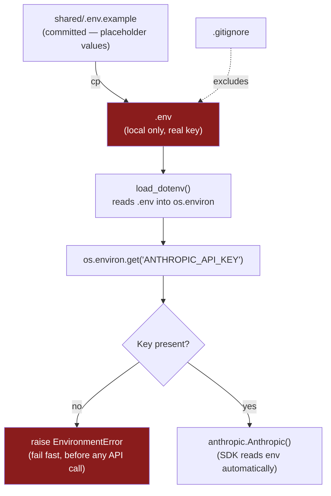

**The pattern, verbatim, from every lab script in this course:**

```python
import os
from dotenv import load_dotenv

load_dotenv()

if not os.environ.get("ANTHROPIC_API_KEY"):
    raise EnvironmentError(
        "ANTHROPIC_API_KEY is not set. Copy shared/.env.example to .env and add your key."
    )

client = anthropic.Anthropic()
```

Why each line matters:

| Line | Why |
|---|---|
| `load_dotenv()` called **before** any `os.environ` read | `.env` values don't exist in the process environment until this runs |
| Explicit presence check with a **descriptive** `EnvironmentError` | Fails fast, at startup, with a message that tells the developer exactly what to do — not a cryptic `AuthenticationError` three lines into execution |
| `anthropic.Anthropic()` with no arguments | The SDK reads `ANTHROPIC_API_KEY` itself; you never touch the raw string in code, so it can't accidentally end up in a log line, a stack trace, or a commit |

**Non-negotiables (checked by `grep -r "sk-ant" code/` in the Lab 1 success criteria):**

- Never hardcode a key as a string literal, in code, tests, or a notebook cell.
- Never commit `.env` — the repo's `.gitignore` already excludes it and only allows
  `shared/.env.example` (placeholder values only) to be tracked.
- Never print or log the raw key. It's fine — and useful for debugging — to print `response.usage`
  and `response._request_id`; it is never fine to print `os.environ["ANTHROPIC_API_KEY"]`.
- If a key is ever pushed to a remote by accident, treat it as burned: revoke it in the Console and
  issue a new one before doing anything else.

---

### 4. Request/response structure

A `messages.create()` call has a small, fixed anatomy on both sides of the wire:

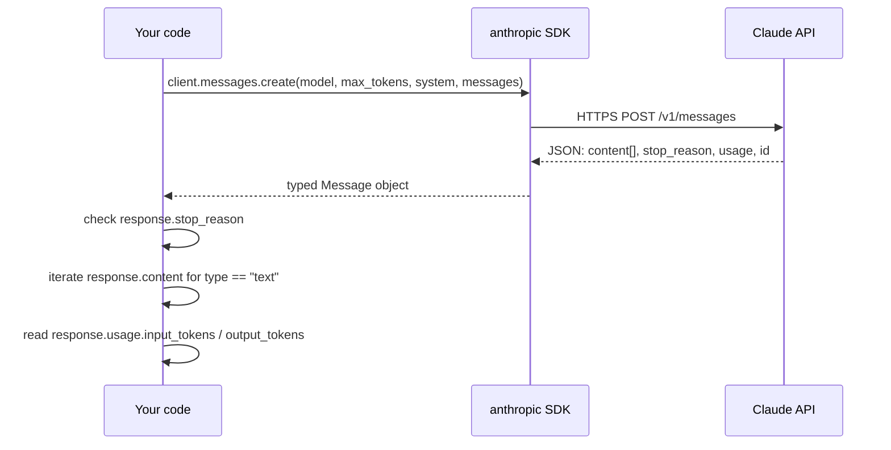

**Request — the four parameters every call in this course starts with:**

```python
response = client.messages.create(
    model="claude-haiku-4-5",   # which model serves this request
    max_tokens=1024,            # hard ceiling on output tokens
    system=SYSTEM_PROMPT,       # role/rules — separate from the conversation
    messages=messages,          # [{"role": "user"|"assistant", "content": ...}, ...]
)
```

**Response — the fields you actually read, every time:**

| Field | Type | What it's for |
|---|---|---|
| `response.content` | list of content blocks | The reply — iterate and check `block.type == "text"` (later modules add `tool_use` blocks here too) |
| `response.stop_reason` | str | *Why* generation stopped — see the table below |
| `response.usage.input_tokens` / `.output_tokens` | int | Actual token counts, for cost tracking and logging |
| `response._request_id` | str | Anthropic's opaque ID for this call — hand this to support if something misbehaves |

**`stop_reason` values you must branch on:**

| `stop_reason` | Meaning | What to do |
|---|---|---|
| `"end_turn"` | Model finished naturally | Normal path — read the content |
| `"max_tokens"` | Output was cut off at your `max_tokens` ceiling | Warn/log; consider raising `max_tokens` or shortening the prompt |
| `"stop_sequence"` | Hit a custom `stop_sequences` string | Expected if you set one deliberately |
| `"tool_use"` | Model wants to call a tool (Module 5+) | Not relevant yet in Module 1 — every Day 1 lab loop assumes `end_turn` |

Never assume `response.content[0].text` is safe to read blind — always check `stop_reason` first,
and iterate `response.content` for blocks of `type == "text"` rather than indexing `[0]` directly.

---

### 5. Error handling

The SDK raises a small, typed exception hierarchy that maps to real failure modes you will hit in
practice — a bad key, a rate limit, a network blip, or a server-side error. Catching
`Exception` generically throws away information you need to respond correctly.

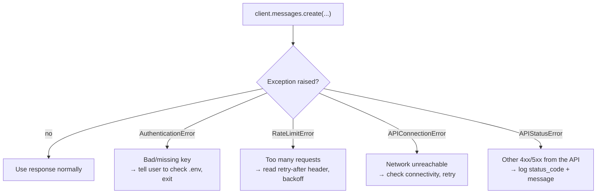

**The pattern used across every lab script:**

```python
import anthropic

try:
    response = client.messages.create(
        model="claude-haiku-4-5",
        max_tokens=1024,
        system=SYSTEM_PROMPT,
        messages=messages,
    )
except anthropic.AuthenticationError:
    print("ERROR: Invalid API key — check ANTHROPIC_API_KEY in your .env file.")
    raise SystemExit(1)
except anthropic.RateLimitError as e:
    retry_after = int(e.response.headers.get("retry-after", "60"))
    print(f"ERROR: Rate limited — retry after {retry_after} seconds.")
    raise SystemExit(1)
except anthropic.APIConnectionError:
    print("ERROR: Cannot reach the API — check your network connection.")
    raise SystemExit(1)
except anthropic.APIStatusError as e:
    print(f"ERROR: API returned status {e.status_code}: {e.message}")
    raise SystemExit(1)
```

| Exception | Typical cause | Recommended response |
|---|---|---|
| `AuthenticationError` | Missing/invalid/revoked key | Fail immediately with a message pointing at `.env` — don't retry |
| `RateLimitError` | Too many requests too fast | Read the `retry-after` response header; back off before retrying |
| `APIConnectionError` | DNS/network failure, no response reached the API | Check connectivity; safe to retry with backoff |
| `APIStatusError` | Any other 4xx/5xx the SDK didn't map to a more specific type | Log `e.status_code` and `e.message`; behaviour depends on the code |

**Order matters:** catch the more specific exceptions before any broader ones, and never swallow
an exception silently — every handler above either exits with a clear message or (in production
code) retries with backoff and logs the `request_id` per the course's
[security ground rules](../README.md#security-ground-rules-apply-to-every-module).

---

### 6. Cost and usage awareness

Two distinct measurements matter, at two distinct times:

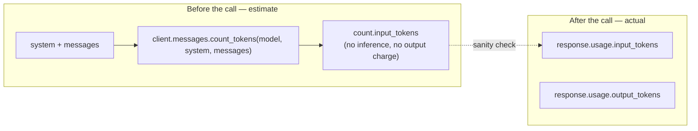

**Before the call — estimate cost without spending on output:**

```python
count = client.messages.count_tokens(
    model="claude-haiku-4-5",
    system=SYSTEM_PROMPT,
    messages=messages,
)
print(f"Estimated input tokens: {count.input_tokens}")
```

`count_tokens()` does **not** run inference — it costs nothing and returns instantly. Use it to
sanity-check a request before you send it, especially once you're injecting large documents into
the prompt (Module 6 onward).

**After the call — read what was actually billed:**

```python
print(f"Input tokens  : {response.usage.input_tokens}")
print(f"Output tokens : {response.usage.output_tokens}")
print(f"Request ID    : {response._request_id}")
```

**On dollar figures:** lab code in this course sometimes multiplies token counts by an illustrative
per-token rate (e.g. `count.input_tokens * 0.000001`) purely to make the *shape* of a cost
calculation concrete during the exercise. Treat any such constant as a placeholder, not a quoted
price — **always check current per-model rates at
[platform.claude.com/docs](https://platform.claude.com/docs)** before using a number for a real
budget or cost report. `project_template/loan_origination_assistant.py`'s Phase 1
`estimate_cost()` exercise makes you look up and hardcode the real Sonnet rate yourself for exactly
this reason.

**Habits to carry forward into every later module:**

- Log `input_tokens`, `output_tokens`, and `request_id` for every call in anything beyond a
  throwaway script — this is your only lever for debugging cost or behaviour after the fact.
- Treat `count_tokens()` as a pre-flight check, not a replacement for reading `response.usage`
  after the real call.
- From Module 4 onward you'll track *cumulative* tokens across a conversation and summarise/reset
  history once a threshold is crossed — the single-call habits here are the foundation for that.

---

## Annotated walkthrough: `secure_call.py`

The reference implementation for this module (`day1/secure_call.py`) puts §§1–6 together in ~80
lines. Reading it top to bottom after this guide should feel like recognising every piece:

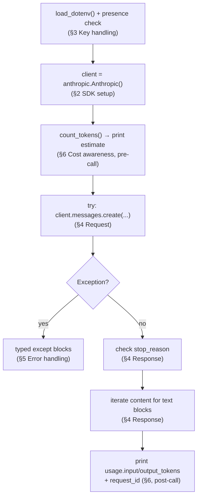

Run it yourself:

```bash
cd day1
python secure_call.py
```

Expect: a printed token estimate, the assistant's answer about Apex Bank's maximum DTI ratio for a
home loan, then a usage block with input/output token counts and a request ID — no stack trace, no
key ever printed.

---

## Common pitfalls

| Pitfall | Symptom | Fix |
|---|---|---|
| `load_dotenv()` called after reading `os.environ` | `EnvironmentError` even though `.env` looks correct | Call `load_dotenv()` as the first executable line |
| Hardcoded key string | Passes locally, fails `grep -r "sk-ant"` check; security risk | Always read via `os.environ` / SDK default |
| Reading `response.content[0].text` blind | `IndexError` or wrong content when the first block isn't text | Iterate `response.content`, filter on `block.type == "text"` |
| Not checking `stop_reason` | Silently truncated answers ship to users | Check for `"max_tokens"` before trusting the output |
| Catching bare `Exception` | Can't distinguish "retry me" from "fix your key" | Catch `AuthenticationError` / `RateLimitError` / `APIConnectionError` / `APIStatusError` separately |
| Treating `count_tokens()` cost math as real pricing | Budget estimates drift from actual invoices | Use it for shape/estimation only; verify rates on the pricing page |
| `.env` committed accidentally | Key exposed in git history | Confirmed excluded by `.gitignore`; if it happens anyway, rotate the key immediately |

---

## Cheat sheet

```python
# ── Setup (once per script) ─────────────────────────────────────────────
import os, anthropic
from dotenv import load_dotenv

load_dotenv()
if not os.environ.get("ANTHROPIC_API_KEY"):
    raise EnvironmentError("ANTHROPIC_API_KEY is not set.")
client = anthropic.Anthropic()

# ── Pre-call cost estimate ──────────────────────────────────────────────
count = client.messages.count_tokens(model=MODEL, system=SYSTEM, messages=messages)

# ── The call, fully guarded ─────────────────────────────────────────────
try:
    response = client.messages.create(
        model=MODEL, max_tokens=1024, system=SYSTEM, messages=messages,
    )
except anthropic.AuthenticationError:
    raise SystemExit("Invalid API key — check .env")
except anthropic.RateLimitError as e:
    raise SystemExit(f"Rate limited — retry after {e.response.headers.get('retry-after', '60')}s")
except anthropic.APIConnectionError:
    raise SystemExit("Cannot reach the API — check your network")
except anthropic.APIStatusError as e:
    raise SystemExit(f"API {e.status_code}: {e.message}")

# ── Read the response safely ────────────────────────────────────────────
if response.stop_reason == "max_tokens":
    print("WARNING: truncated — increase max_tokens")

text = next((b.text for b in response.content if b.type == "text"), "")
print(f"in={response.usage.input_tokens} out={response.usage.output_tokens} "
      f"id={response._request_id}")
```

---

## Where Module 1 fits in the course

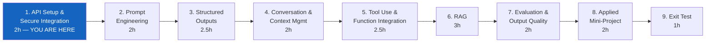

| Module | Case study | Folder |
|---|---|---|
| 1. API Setup and Secure Integration | Secure, env-managed Claude call | `day1/` (`secure_call.py`, `lab1.md`) |
| 2. Prompt Engineering for Applications | Finance credit-policy explainer | `day1/` (`credit_policy_assistant.py`, `lab2.md`) |
| 3. Structured Outputs and Validation | Retail product enrichment | `day2/` |
| 4. Conversation and Context Management | Telecom complaint summariser | `day2/` |
| 5. Tool Use and Function Integration | Invoice validation + vendor lookup | `day3/` |
| 6. Retrieval-Grounded Responses (RAG) | Finance SOP assistant | `day3/` – `day4/` |
| 7. Evaluation and Output Quality | Evaluate the RAG assistant | `day4/` – `day5/` |
| 8. Applied Mini-Project | Telecom support triage assistant | `day5/` |
| 9. Exit Test | Scenario assessment | — |

**Reference material:** [`README.md`](../README.md) (program overview, version policy, security
ground rules) · [`SETUP.md`](../SETUP.md) (environment setup) ·
[`day5/patterns_reference.md`](../day5/patterns_reference.md) (all five recurring API patterns in
one card) · [`day1/lab1.md`](../day1/lab1.md) (this module's graded lab).
