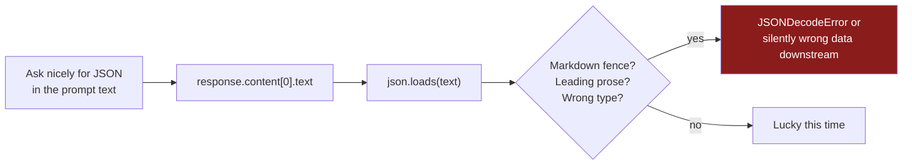
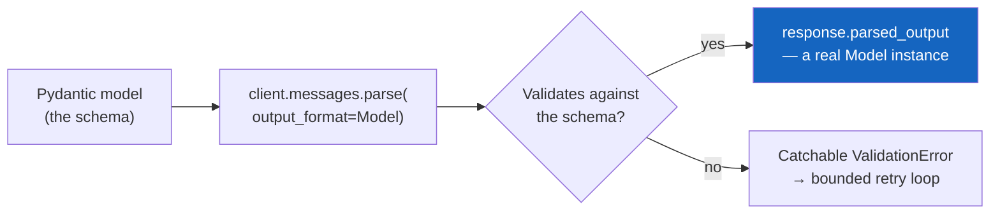
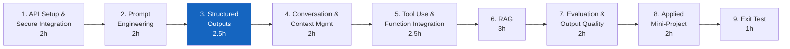
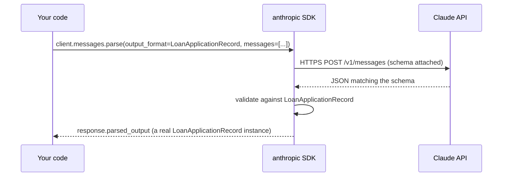
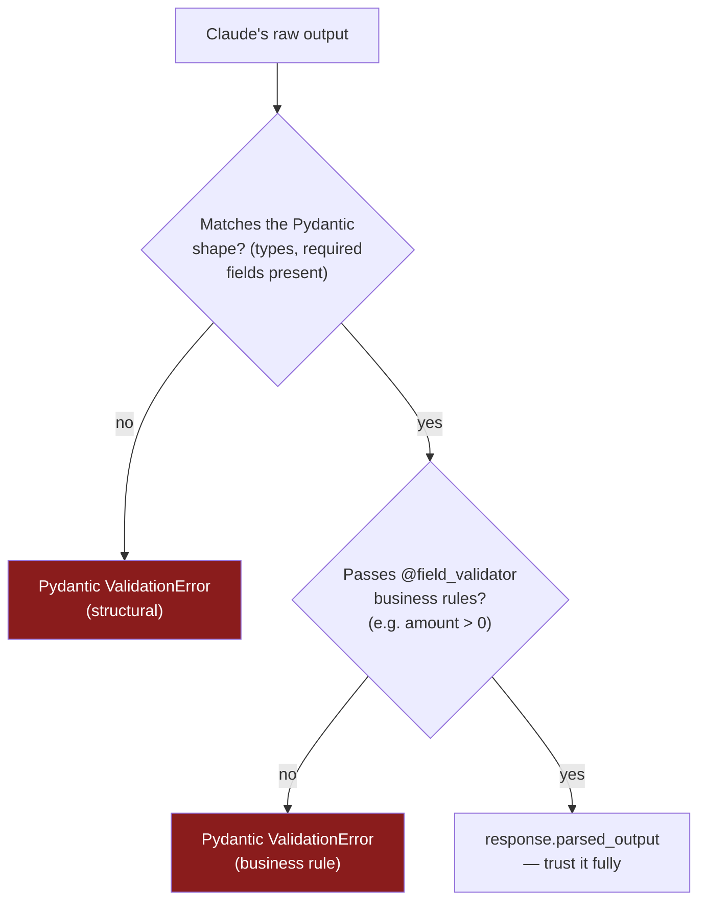
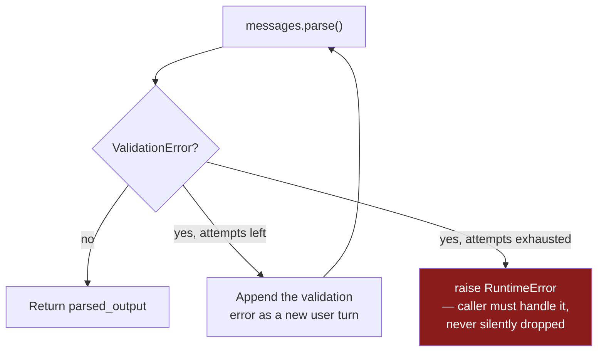
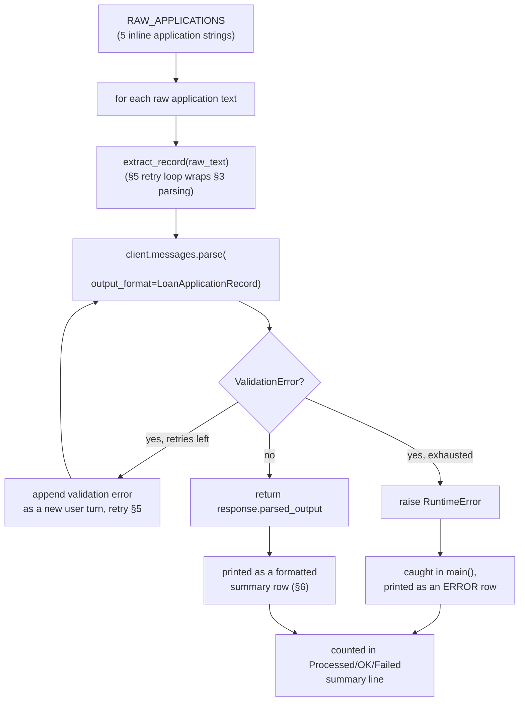
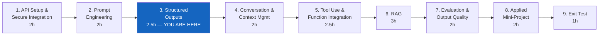

# Module 3 — Structured Outputs and Validation

**Course:** Building with Claude (StackRoute | RPS Consulting, an NIIT venture)
**Module duration:** 2.5 hours · **Audience:** Software/application developers, data engineers, solution architects
**Hands-on artifact:** `day2/loan_application_extractor.py` · `day2/lab3.md`

> This guide is a self-paced companion to the live-connect session. It picks up right where
> [Module 2](module-02-prompt-engineering-for-applications.md) left off — a system prompt with
> reliable role, constraints, format, and examples — and walks through every Module 3 topic from
> the course design: **JSON generation, schema-driven prompting, parsing, validation, retries, and
> downstream integration.** The running example is Apex Bank's loan-application data extraction
> pipeline.

---

## Table of contents

1. [Part A — From a Reliable Prompt to a Guaranteed Shape](#part-a--from-a-reliable-prompt-to-a-guaranteed-shape)
2. [Part B — Module 3: Structured Outputs and Validation](#part-b--module-3-structured-outputs-and-validation)
   1. [JSON generation](#1-json-generation)
   2. [Schema-driven prompting](#2-schema-driven-prompting)
   3. [Parsing](#3-parsing)
   4. [Validation](#4-validation)
   5. [Retries](#5-retries)
   6. [Downstream integration](#6-downstream-integration)
3. [Annotated walkthrough: `loan_application_extractor.py`](#annotated-walkthrough-loan_application_extractorpy)
4. [Common pitfalls](#common-pitfalls)
5. [Cheat sheet](#cheat-sheet)
6. [Where Module 3 fits in the course](#where-module-3-fits-in-the-course)

---

## Part A — From a Reliable Prompt to a Guaranteed Shape

### A.1 What Module 2 already gave you

By the end of Module 2 you could write a system prompt that behaves consistently — cites its
source, refuses out-of-scope questions with an exact string, and holds up under an adversarial
question. What it still can't do is **guarantee** that the answer is machine-readable. A perfectly
well-behaved prompt can still return valid-looking prose that no downstream system can safely
parse: a stray sentence before the JSON, a trailing markdown fence, a number written as `"45L"`
instead of `45,00,000`.

Module 3 closes that gap. You're not writing better prompts *instead of* Module 2's habits — the
system prompt in `loan_application_extractor.py` still has instructions Claude follows — you're
adding a **schema** that the SDK itself enforces, so "the model complied with my format
instructions" becomes "the object is guaranteed to match the schema, or you get an explicit,
catchable error."

### A.2 Why this is engineering, not JSON.parse()

The naive version of structured output is: ask nicely for JSON, then `json.loads()` the text back.
That works until it doesn't — and it fails silently in exactly the ways that are expensive to
catch downstream (a loan officer's dashboard rendering `"loan_amount_inr": "forty-five lakh"` as a
string instead of a number).



Module 3's alternative replaces "ask nicely and hope" with "declare the shape, let the SDK
validate it, and handle the explicit failure":



### A.3 Where Module 3 sits in the course



The `LoanApplicationRecord` you validate here is the same shape Module 4's conversation manager
produces at the end of an intake session, Module 5's tools populate additional fields on
(`credit_score`, `documents_verified`), and Module 7 scores for field-level accuracy. Get the
schema and retry discipline right here and every later module inherits it for free.

---

## Part B — Module 3: Structured Outputs and Validation

**Course design table (verbatim scope for this module):**

> JSON generation, schema-driven prompting, parsing, validation, retries, and downstream
> integration.
> **Hands-on (course design):** Generate validated JSON for a retail product-enrichment task.
> **Implemented in this repo as:** Apex Bank loan-application data extraction (see
> [`day2/lab3.md`](../day2/lab3.md) / [`day2/loan_application_extractor.py`](../day2/loan_application_extractor.py)),
> per this repo's finance-domain convention documented in `CLAUDE.md` ("every code sample models
> the finance domain: an 'Apex Bank' loan origination / credit-policy assistant").
> **Tools:** Claude API; JSON Schema; Pydantic-style validation.

By the end of this module you can:

- [ ] Explain why `client.messages.parse(output_format=...)` is safer than `create()` + manual
      `json.loads()` for any pipeline downstream systems depend on
- [ ] Define a Pydantic schema with `Literal` constraints, `Optional` fields, and a `field_validator`
      in the correct decorator order
- [ ] Read a validated object straight from `response.parsed_output` with no manual parsing step
- [ ] Write a bounded retry loop that feeds the validation error back to Claude and knows when to
      stop and report failure instead of looping forever
- [ ] Explain why retries fix a *model* mistake, never a *source-data* gap
- [ ] Describe what "downstream integration" means for a validated record — and why it doesn't
      need any further defensive parsing once it exists

---

### 1. JSON generation

Before `messages.parse()` existed as an SDK feature, "structured output" meant instructing Claude
to produce JSON in plain text and parsing it yourself:

```python
# The fragile way — don't do this for anything downstream depends on
response = client.messages.create(
    model=MODEL, max_tokens=512,
    system="Return ONLY a JSON object with these fields: ...",
    messages=[{"role": "user", "content": raw_text}],
)
data = json.loads(response.content[0].text)   # breaks on a fence, a leading sentence, ...
```

`loan_application_extractor.py` never does this. Every extraction goes through
`client.messages.parse(output_format=LoanApplicationRecord)`, so there is no raw-text JSON step to
break in the first place — see [§3](#3-parsing).

| Approach | What can go wrong | Where it's used in this repo |
|---|---|---|
| `create()` + prompt-asked JSON + `json.loads()` | Markdown fences, leading/trailing prose, wrong types (a number as a string) all break parsing | Never — shown above only as the pitfall this module avoids |
| `messages.parse(output_format=Model)` | Still possible: the *content* can be wrong (e.g. a hallucinated field value) — but the *shape* is guaranteed | `day2/loan_application_extractor.py`, this module's reference script |

---

### 2. Schema-driven prompting

The schema is a Pydantic `BaseModel` — it's both the contract Claude's output must satisfy and the
type you get back in your code, with no separate parsing step:

```python
from typing import Literal, Optional
from pydantic import BaseModel, field_validator

class LoanApplicationRecord(BaseModel):
    applicant_name: str
    loan_type: Literal["home_loan", "personal_loan", "business_loan", "vehicle_loan"]
    loan_amount_inr: float
    monthly_income_inr: float
    tenure_years: int
    credit_score: Optional[int] = None

    @field_validator("loan_amount_inr")
    @classmethod
    def amount_must_be_positive(cls, v: float) -> float:
        if v <= 0:
            raise ValueError("loan_amount_inr must be positive")
        return v
```

| Field | Type choice | Why |
|---|---|---|
| `loan_type` | `Literal[...]` of exactly 4 values | Constrains Claude to a closed set instead of free text — no `"Home Loan"` vs `"home loan"` drift downstream |
| `credit_score` | `Optional[int] = None` | Some applicants genuinely don't have a bureau score yet (see Application 2, Sunita Rao) — the schema must allow *absence*, not force a guess |
| `loan_amount_inr` | `float`, no default | Every application must state an amount — if it can't, extraction should fail loudly (see [§5](#5-retries)), not silently default to `0.0` |

Prompt-side, this doesn't replace Module 2's discipline — it *reduces the surface area* the prompt
has to cover. You still tell Claude what the fields mean; you no longer have to describe the exact
output format in prose, because `output_format=` enforces it structurally.

---

### 3. Parsing

`messages.parse()` returns the validated object directly on `response.parsed_output` — no
`response.content[0].text`, no `json.loads()`:



```python
response = client.messages.parse(
    model=MODEL,
    max_tokens=512,
    temperature=0,
    messages=messages,
    output_format=LoanApplicationRecord,
)
record = response.parsed_output          # already validated — use record.loan_amount_inr directly
```

`temperature=0` in the reference script is deliberate here: extraction is a task with one correct
answer per input, not a creative one — lower temperature makes the schema-conformant output more
reproducible across repeated runs on the same text.

---

### 4. Validation

Validation happens in two layers, and it's worth being able to name which layer catches what:



Both layers raise the same `pydantic.ValidationError` type — you don't need to distinguish them in
your `except` clause, only decide what to do with the message (see [§5](#5-retries)).

**Decorator order matters and is easy to get backwards:**

```python
@field_validator("loan_amount_inr")   # 1. declares which field this validates
@classmethod                          # 2. sits directly above the function
def amount_must_be_positive(cls, v: float) -> float:
    ...
```

`@field_validator(...)` goes on top, `@classmethod` directly below it, immediately above `def`.
Reverse the two and Pydantic either errors at class-definition time or silently doesn't bind `cls`
the way you expect — a mistake that's confusing precisely because it fails before you ever send a
request, not when you're debugging the extraction itself.

---

### 5. Retries

A validation failure is not necessarily a dead end — often the fix is just telling Claude what
went wrong and asking again, the same "feed the error back" idea Module 2 used for reducing
unsupported output, applied here to schema errors instead of policy violations:

```python
def extract_record(raw_text: str, max_retries: int = 2) -> LoanApplicationRecord:
    messages = [{"role": "user", "content": f"Extract the loan application fields from: '{raw_text}'"}]
    for attempt in range(max_retries + 1):
        try:
            response = client.messages.parse(
                model=MODEL, max_tokens=512, temperature=0,
                messages=messages, output_format=LoanApplicationRecord,
            )
            return response.parsed_output
        except ValidationError as e:
            if attempt == max_retries:
                raise RuntimeError(
                    f"Failed to extract after {max_retries} retries. "
                    f"Original text: {raw_text!r}"
                ) from e
            # client.messages.parse() raises ValidationError from INSIDE the call
            # itself, so `response` is never bound here — there's no raw assistant
            # text available to echo back, only the error detail.
            messages.append({"role": "user", "content": f"Your previous output failed schema validation:\n{e}\n\nPlease return a corrected JSON object that matches the schema exactly."})
```



> **Why there's no "echo the bad output back" step:** `client.messages.parse()` validates
> internally and raises `ValidationError` from *inside* the call — so unlike a plain
> `messages.create()` call, there is no `response` object available in the `except` block to pull
> the raw (invalid) text from. The validation error message itself already names the offending
> field and value (e.g. `loan_amount_inr ... input_value=0`), which is enough context for Claude to
> self-correct on retry.

**The one distinction that matters most:** a retry loop fixes a *model* mistake — wrong type, a
value outside the allowed `Literal` set, a business-rule violation. It cannot fix *missing source
data*. If the raw text genuinely never states a loan amount, no amount of re-prompting produces a
truthful positive number — the correct outcome is the extraction failing and being reported, not
Claude guessing a plausible-sounding figure. `day2/lab3.md`'s success criteria make this explicit:
*"Failed inputs reported with original text, not silently skipped."*

> **See both branches:** `labs/module-03/demos/02-validation-retry/` runs this exact loop against
> a genuinely incomplete application to confirm it fails after 2 retries rather than fabricating a
> number, and [`02-validation-retry-loop.html`](../labs/module-03/02-validation-retry-loop.html)
> animates the retry loop step by step.

---

### 6. Downstream integration

Once you have `response.parsed_output`, you have a real `LoanApplicationRecord` instance — not a
dict that might be missing a key, not a string that might not be valid JSON. Every downstream
consumer (a summary table, a core-banking system row, a credit-committee queue) can read
`record.loan_amount_inr` directly with no defensive `.get()` calls or type checks:

```python
score_str = str(record.credit_score) if record.credit_score else "N/A"
print(f"{i:<3}  {record.applicant_name:<20} {record.loan_type:<16} "
      f"{record.loan_amount_inr:<14,.0f} {record.monthly_income_inr:<12,.0f} "
      f"{record.tenure_years:<8} {score_str}")
```

This is the smallest possible example of "downstream integration" — a formatted print — but the
principle is the same one Module 4 builds on (a `LoanApplicationRecord`-shaped session summary),
Module 5 extends (tools populate `credit_score` and a `documents_verified` flag on top of the same
record), and Module 7 evaluates (field-level accuracy against a golden set). The schema is the
seam every later module plugs into.

> **See it applied three ways:** `labs/module-03/demos/03-downstream-integration/` reshapes
> validated records into a core-banking CSV row, a credit-committee referral queue, and a DTI risk
> bucket — all without touching Claude or re-validating anything, because the record is already
> trustworthy.

---

## Annotated walkthrough: `loan_application_extractor.py`



`RAW_APPLICATIONS` is a compact, hand-written one-line-per-applicant version of the same five
people described in
[`shared/data/apex_bank_loan_applications.md`](../shared/data/apex_bank_loan_applications.md) —
the reference script keeps its test set short and deterministic, while the shared data file gives
you the fuller, messier, narrative-form version of the same five applications to practice
extraction against yourself (longer sentences, indirect phrasing like "I don't know my credit
score off-hand").

Run it yourself:

```bash
cd day2
python loan_application_extractor.py
```

Expect: a formatted table with one row per applicant (name, loan type, amount, income, tenure,
credit score — or `N/A` for Sunita Rao, who never states one), followed by
`Processed: 5  |  OK: 5  |  Failed: 0`.

---

## Common pitfalls

| Pitfall | Symptom | Fix |
|---|---|---|
| Manual `json.loads()` on a `create()` response | Breaks on a markdown fence or a leading sentence Claude adds | Use `client.messages.parse(output_format=Model)` — no raw-text step to break |
| `@classmethod` above `@field_validator` (reversed order) | Confusing error at class-definition time, before any request is sent | `@field_validator(...)` on top, `@classmethod` directly below it, right above `def` |
| Catching bare `Exception` instead of `ValidationError` | The retry loop also swallows real bugs (network errors, bad model name) silently | Catch `pydantic.ValidationError` specifically |
| No bound on retries | A persistently bad extraction loops forever, or silently burns cost | Cap retries (2, in this lab) and raise/report explicitly on exhaustion |
| Silently skipping a failed record | Violates Lab 3's success criteria — no visibility into what didn't extract | Report the original text and the error, per `extract_record`'s `RuntimeError` |
| Forgetting `Optional[...] = None` on a genuinely-sometimes-missing field | Validation fails on inputs that never had that data in the first place (e.g. no credit score yet) | Make fields optional only when the *source* can legitimately omit them — not as a blanket escape hatch |
| Retrying on missing source data as if it were a model mistake | Claude eventually fabricates a plausible-sounding value just to satisfy the schema | Recognise the difference: retries fix format/type errors, not information the text never contained |

---

## Cheat sheet

```python
from typing import Literal, Optional
from pydantic import BaseModel, field_validator, ValidationError

# ── Schema (§2) ──────────────────────────────────────────────────────────
class LoanApplicationRecord(BaseModel):
    applicant_name: str
    loan_type: Literal["home_loan", "personal_loan", "business_loan", "vehicle_loan"]
    loan_amount_inr: float
    monthly_income_inr: float
    tenure_years: int
    credit_score: Optional[int] = None

    @field_validator("loan_amount_inr")
    @classmethod
    def amount_must_be_positive(cls, v: float) -> float:
        if v <= 0:
            raise ValueError("loan_amount_inr must be positive")
        return v

# ── Parse + bounded retry (§3, §5) ───────────────────────────────────────
def extract_record(raw_text: str, max_retries: int = 2) -> LoanApplicationRecord:
    messages = [{"role": "user", "content": f"Extract the loan application fields from: '{raw_text}'"}]
    for attempt in range(max_retries + 1):
        try:
            response = client.messages.parse(
                model=MODEL, max_tokens=512, temperature=0,
                messages=messages, output_format=LoanApplicationRecord,
            )
            return response.parsed_output
        except ValidationError as e:
            if attempt == max_retries:
                raise RuntimeError(f"Failed after {max_retries} retries: {raw_text!r}") from e
            # no `response` bound here — parse() raised before returning; feed the error alone
            messages.append({"role": "user", "content": f"Validation failed:\n{e}\n\nReturn corrected JSON."})

# ── Downstream use — no defensive parsing needed (§6) ───────────────────
record = extract_record(raw_text)
print(f"{record.applicant_name}: {record.loan_type}, INR {record.loan_amount_inr:,.0f}")
```

---

## Where Module 3 fits in the course



| Module | Case study | Folder |
|---|---|---|
| 1. API Setup and Secure Integration | Secure, env-managed Claude call | `day1/` (`secure_call.py`, `lab1.md`) |
| 2. Prompt Engineering for Applications | Finance credit-policy explainer | `day1/` (`credit_policy_assistant.py`, `lab2.md`) |
| 3. Structured Outputs and Validation | Apex Bank loan-application data extraction | `day2/` (`loan_application_extractor.py`, `lab3.md`) |
| 4. Conversation and Context Management | Apex Bank loan intake conversation manager | `day2/` (`loan_intake_manager.py`, `lab4.md`) |
| 5. Tool Use and Function Integration | Invoice validation + vendor lookup | `day3/` |
| 6. Retrieval-Grounded Responses (RAG) | Finance SOP assistant | `day3/` – `day4/` |
| 7. Evaluation and Output Quality | Evaluate the RAG assistant | `day4/` |
| 8. Applied Mini-Project | Telecom support triage assistant | `day5/` |
| 9. Exit Test | Scenario assessment | — |

> Rows 3–4 are corrected from earlier drafts of this table (which followed the course PDF's
> generic retail/telecom hands-on cells) to match what's actually built in `day2/` — see
> `CLAUDE.md`'s finance-domain convention. Rows 5–7 are now confirmed against real files in
> `day3/`–`day4/` — row 8 still describes `day5/` content that doesn't exist in this repo yet;
> double-check its case study against the real files once that folder is built.

**Reference material:** [`module-02-prompt-engineering-for-applications.md`](module-02-prompt-engineering-for-applications.md)
(the prompting habits this module builds on) · [`SETUP.md`](../SETUP.md) (environment setup) ·
[`shared/data/apex_bank_loan_applications.md`](../shared/data/apex_bank_loan_applications.md)
(the fuller narrative-form dataset) · [`day2/lab3.md`](../day2/lab3.md) (this module's graded lab) ·
[`day2/loan_application_extractor.py`](../day2/loan_application_extractor.py) (reference
implementation) · [`labs/module-03/demos/`](../labs/module-03/demos/) (three standalone demos) ·
interactive visualizations:
[schema anatomy](../labs/module-03/01-schema-anatomy.html) ·
[validation retry loop](../labs/module-03/02-validation-retry-loop.html) ·
[freeform vs. schema](../labs/module-03/03-freeform-vs-schema.html).
