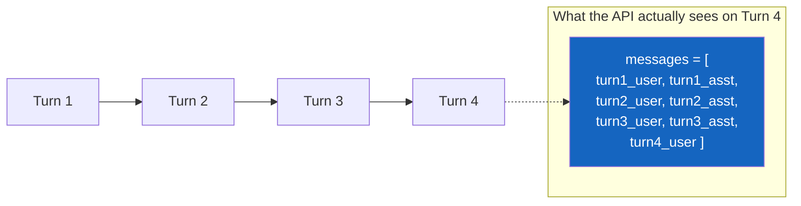
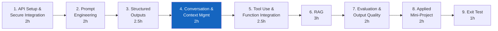
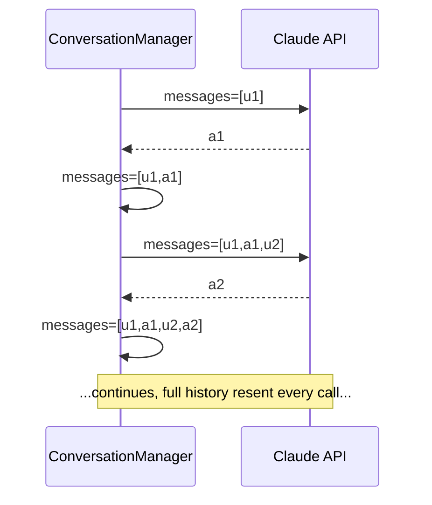
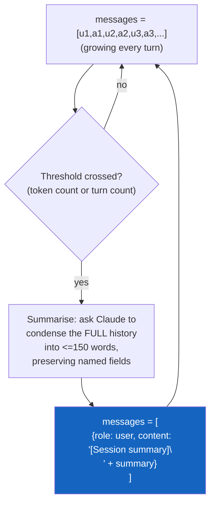
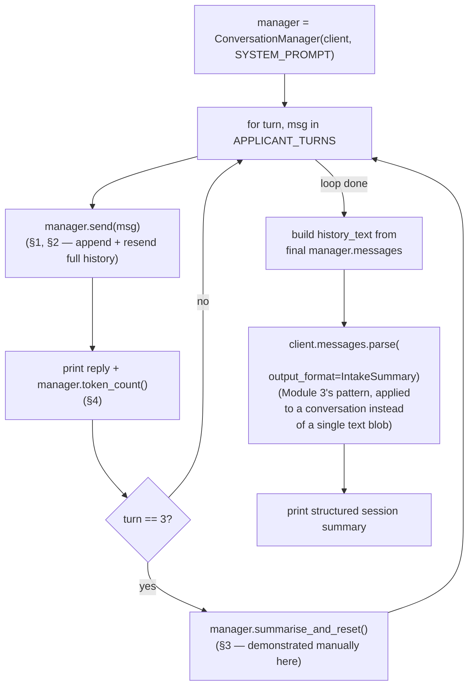
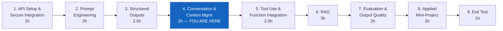

# Module 4 — Conversation and Context Management

**Course:** Building with Claude (StackRoute | RPS Consulting, an NIIT venture)
**Module duration:** 2 hours · **Audience:** Software/application developers, data engineers, solution architects
**Hands-on artifact:** `day2/loan_intake_manager.py` · `day2/lab4.md`

> This guide is a self-paced companion to the live-connect session. It picks up right where
> [Module 3](module-03-structured-outputs-and-validation.md) left off — a validated
> `LoanApplicationRecord` produced from a single turn of text — and walks through every Module 4
> topic from the course design: **message formatting, conversation memory, summarisation memory,
> and token-aware design.** The running example is Apex Bank's multi-turn loan intake session.

---

## Table of contents

1. [Part A — From One Validated Turn to a Whole Conversation](#part-a--from-one-validated-turn-to-a-whole-conversation)
2. [Part B — Module 4: Conversation and Context Management](#part-b--module-4-conversation-and-context-management)
   1. [Message formatting](#1-message-formatting)
   2. [Conversation memory](#2-conversation-memory)
   3. [Summarisation memory](#3-summarisation-memory)
   4. [Token-aware design](#4-token-aware-design)
3. [Annotated walkthrough: `loan_intake_manager.py`](#annotated-walkthrough-loan_intake_managerpy)
4. [Common pitfalls](#common-pitfalls)
5. [Cheat sheet](#cheat-sheet)
6. [Where Module 4 fits in the course](#where-module-4-fits-in-the-course)

---

## Part A — From One Validated Turn to a Whole Conversation

### A.1 What Module 3 already gave you

Module 3 validated a single extraction: one raw text in, one `LoanApplicationRecord` out. Real
loan intake rarely arrives as one clean paragraph — an applicant states their name, then their
loan type, then their income, across several back-and-forth turns. Module 4 is about managing
*that* — a conversation with state, growing history, and a token budget — while still landing on
the same kind of validated structured record Module 3 taught you to trust.

### A.2 Why this is engineering, not "just keep chatting"

The Claude API has no server-side memory: every call is stateless. If you don't send the earlier
turns back, Claude has no way to know they happened — there is no session, no cookie, no ID that
recalls prior context on the server. Everything the model "remembers" about the conversation is
whatever you put in `messages` on *this* call.



That has two direct consequences this module is built around: you must **resend the full history
every call** (conversation memory), and that history **grows without bound** unless you actively
manage it (summarisation memory, token-aware design). Neither is optional once a conversation runs
past a handful of turns.

### A.3 Where Module 4 sits in the course



The multi-turn history habits here carry straight into Module 5's agentic tool loop (which is
itself a growing `messages` list with `tool_use`/`tool_result` turns added in) and Module 6's RAG
assistant (which injects retrieved context into an otherwise-similar growing conversation).

---

## Part B — Module 4: Conversation and Context Management

**Course design table (verbatim scope for this module):**

> Message formatting, conversation memory, summarisation memory, and token-aware design.
> **Hands-on (course design):** Build a telecom complaint summariser with a next-best-action
> output.
> **Implemented in this repo as:** an Apex Bank loan intake conversation manager (see
> [`day2/lab4.md`](../day2/lab4.md) / [`day2/loan_intake_manager.py`](../day2/loan_intake_manager.py)),
> per this repo's finance-domain convention documented in `CLAUDE.md` ("every code sample models
> the finance domain: an 'Apex Bank' loan origination / credit-policy assistant").
> **Tools:** Claude API; long-context techniques.

By the end of this module you can:

- [ ] Explain why the Claude API is stateless and what that requires of your client code
- [ ] Build a `ConversationManager` that appends both sides of every turn and resends the full
      history on each call
- [ ] Monitor conversation length with `client.messages.count_tokens()` after every turn
- [ ] Implement summarise-and-reset: distil a growing history into one compact summary turn once a
      threshold is crossed, without losing the fields that matter
- [ ] Produce a final structured summary of a multi-turn conversation with `messages.parse()`

---

### 1. Message formatting

A conversation is just a growing list of `{"role": ..., "content": ...}` turns, alternating
`"user"` and `"assistant"` — the same shape Module 1 introduced for a single call, now maintained
across many:

```python
class ConversationManager:
    def __init__(self, client: anthropic.Anthropic, system: str):
        self.client = client
        self.system = system
        self.messages: list[dict] = []

    def send(self, user_message: str) -> str:
        self.messages.append({"role": "user", "content": user_message})
        response = self.client.messages.create(
            model=MODEL, max_tokens=1024,
            system=self.system, messages=self.messages,
        )
        reply = next((b.text for b in response.content if b.type == "text"), "")
        self.messages.append({"role": "assistant", "content": reply})
        return reply
```

| Call | What's sent | What's new vs. Module 1 |
|---|---|---|
| First `send()` | `system` + 1 user turn | Identical to a Module 1 single call |
| Second `send()` | `system` + 3 turns (user, assistant, user) | The *entire* prior exchange, not just the new message |
| Nth `send()` | `system` + all `2N - 1` prior turns + the new one | Growth is linear in turns — this is what §3–§4 exist to manage |

**Both** lines that append to `self.messages` matter — miss the `assistant` append and the model's
own prior reply silently disappears from what it's shown next turn, which reads to the user as the
officer forgetting what it just said.

---

### 2. Conversation memory

"Memory" here is not a feature of the API — it's a discipline in your client: keep the full turn
list, send it every time. `main()`'s `APPLICANT_TURNS` walks through exactly this:



```python
APPLICANT_TURNS = [
    "Hi, I want to apply for a loan.",
    "My name is Priya Sharma. I need a home loan of around 40 lakhs.",
    "My monthly salary is 80,000 rupees. I've been working for 6 years.",
    "I would like to repay over 20 years. My credit score is around 750.",
]
```

The system prompt tells Claude to ask for "one or two pieces of information at a time" — across
these four turns, Claude accumulates name, loan type, amount, income, tenure, and credit score
purely from context it's re-shown each call, then announces `"INTAKE COMPLETE"` once it has
everything, exactly as instructed.

---

### 3. Summarisation memory

Unbounded history is unbounded cost and, eventually, an unbounded context window problem. The fix
is not to delete history — it's to **compress** it into one dense turn that preserves what
matters:



```python
def summarise_and_reset(self) -> str:
    history_text = "\n".join(f"{m['role'].upper()}: {m['content']}" for m in self.messages)
    response = self.client.messages.create(
        model=MODEL, max_tokens=300,
        messages=[{
            "role": "user",
            "content": (
                "Summarise this loan intake conversation in ≤150 words. "
                "Preserve: applicant name, loan type, amount, income, tenure, credit score.\n\n"
                f"{history_text}"
            ),
        }],
    )
    summary = next((b.text for b in response.content if b.type == "text"), "")
    self.messages = [{"role": "user", "content": f"[Session summary]\n{summary}"}]
    return summary
```

**"Preserve: ..." is not decoration — it's the whole point.** A generic "summarise this" invites
Claude to drop details it judges unimportant; naming the six fields explicitly is the same
discipline Module 2 taught for format rules — say exactly what must survive, don't hope a vague
instruction covers it. Once `self.messages` is replaced, the original turns are **gone** — whatever
the summary didn't capture is unrecoverable for the rest of the session.

---

### 4. Token-aware design

Checking length is what tells you *when* to summarise — without it, §3 never fires:

```python
def token_count(self) -> int:
    result = self.client.messages.count_tokens(
        model=MODEL, system=self.system, messages=self.messages,
    )
    return result.input_tokens

TOKEN_WARN_THRESHOLD = 50_000
```

The reference script demonstrates two different trigger styles side by side, and it's worth
knowing which is which:

| Script | Trigger style | Where |
|---|---|---|
| `loan_intake_manager.py` (scripted, this module's primary reference) | Manually calls `summarise_and_reset()` at a fixed point (`if turn == 3`) so the mechanism is demonstrated deterministically in a 4-turn demo | `main()` |
| `loan_intake_manager_interactive.py` (bonus interactive variant) | Condition-triggered: calls `summarise_and_reset()` whenever `token_count() > TOKEN_WARN_THRESHOLD` | `main()`'s input loop |

A 4-turn scripted demo never naturally reaches 50,000 tokens, so the reference script triggers the
compression manually to make it visible — the *production* trigger is the condition-based one in
the interactive version, which is what you'd actually ship.

> **See it live:** `labs/module-04/demos/02-token-aware-summarization/` runs a longer scripted
> conversation against a deliberately low threshold so the condition-based trigger actually fires,
> and [`02-token-growth-and-summarization.html`](../labs/module-04/02-token-growth-and-summarization.html)
> animates the token count climbing and dropping.

---

## Annotated walkthrough: `loan_intake_manager.py`



Note the final step doesn't pass `system=` — the officer persona was needed to *run* the intake
conversation, not to *classify* it afterward; the classification call is a fresh, single-purpose
extraction over the (possibly already-summarised) history text, using a different, smaller schema
(`IntakeSummary`) purpose-built for a go/no-go decision rather than the full record.

Run it yourself:

```bash
cd day2
python loan_intake_manager.py
```

Expect: four `[Applicant]` / `[Officer]` exchanges with a token count after each, a `[Summary]`
line appearing right after turn 3, and a final `=== Structured Session Summary ===` block with
`applicant_type`, `loan_amount_inr`, `credit_checked`, and `recommended_action`.

For a hands-on feel instead of reading a transcript, run the interactive twin and type your own
answers:

```bash
python loan_intake_manager_interactive.py
```

---

## Common pitfalls

| Pitfall | Symptom | Fix |
|---|---|---|
| Appending only the user turn, not the assistant reply | Claude appears to forget its own previous answer next turn | Append both `{"role": "user", ...}` and `{"role": "assistant", ...}` every `send()` |
| Sending only the newest message, not the full history | The model has no idea a prior conversation happened — the API is stateless | Always pass the complete `self.messages` list on every call |
| A vague "summarise this" prompt | The summary drops a field the downstream schema needs | Name the exact fields to preserve, the same explicit-format discipline as Module 2 |
| Checking tokens only *after* something breaks | No warning before a session runs into context or cost trouble | Call `count_tokens()` after every turn, not as an afterthought |
| Treating the scripted `if turn == 3` trigger as the production pattern | A real session summarises at an arbitrary turn count, not a token-driven one | Use a threshold check (`token_count() > TOKEN_WARN_THRESHOLD`), as in the interactive version |
| Assuming `summarise_and_reset()` is lossless | Any conversational detail not named in the "Preserve: ..." instruction is gone once `self.messages` is replaced | Be exhaustive about what must survive before you reset |
| Passing `system=` into the final structured-summary call out of habit | Extra tokens spent on a persona the extraction task doesn't need | Match the call's purpose — a classification pass needs the data, not the officer role |

---

## Cheat sheet

```python
# ── Conversation manager — memory + formatting (§1, §2) ─────────────────
class ConversationManager:
    def __init__(self, client, system):
        self.client, self.system, self.messages = client, system, []

    def send(self, user_message: str) -> str:
        self.messages.append({"role": "user", "content": user_message})
        response = self.client.messages.create(
            model=MODEL, max_tokens=1024, system=self.system, messages=self.messages,
        )
        reply = next((b.text for b in response.content if b.type == "text"), "")
        self.messages.append({"role": "assistant", "content": reply})
        return reply

    # ── Token-aware design (§4) ──────────────────────────────────────────
    def token_count(self) -> int:
        return self.client.messages.count_tokens(
            model=MODEL, system=self.system, messages=self.messages,
        ).input_tokens

    # ── Summarisation memory (§3) ────────────────────────────────────────
    def summarise_and_reset(self) -> str:
        history_text = "\n".join(f"{m['role'].upper()}: {m['content']}" for m in self.messages)
        response = self.client.messages.create(
            model=MODEL, max_tokens=300,
            messages=[{"role": "user", "content":
                f"Summarise this conversation in <=150 words. Preserve: <name the fields>.\n\n{history_text}"}],
        )
        summary = next((b.text for b in response.content if b.type == "text"), "")
        self.messages = [{"role": "user", "content": f"[Session summary]\n{summary}"}]
        return summary

# ── Usage, with a condition-based (production-style) trigger ────────────
manager = ConversationManager(client, SYSTEM_PROMPT)
reply = manager.send(user_input)
if manager.token_count() > TOKEN_WARN_THRESHOLD:
    manager.summarise_and_reset()

# ── Final structured summary — Module 3's pattern, over a conversation ──
result = client.messages.parse(
    model=MODEL, max_tokens=256,
    messages=[{"role": "user", "content": f"Classify this conversation:\n\n{history_text}"}],
    output_format=IntakeSummary,
)
summary = result.parsed_output
```

---

## Where Module 4 fits in the course



| Module | Case study | Folder |
|---|---|---|
| 1. API Setup and Secure Integration | Secure, env-managed Claude call | `day1/` (`secure_call.py`, `lab1.md`) |
| 2. Prompt Engineering for Applications | Finance credit-policy explainer | `day1/` (`credit_policy_assistant.py`, `lab2.md`) |
| 3. Structured Outputs and Validation | Apex Bank loan-application data extraction | `day2/` (`loan_application_extractor.py`, `lab3.md`) |
| 4. Conversation and Context Management | Apex Bank loan intake conversation manager | `day2/` (`loan_intake_manager.py`, `lab4.md`) |
| 5. Tool Use and Function Integration | Invoice validation + vendor lookup | `day3/` |
| 6. Retrieval-Grounded Responses (RAG) | Finance SOP assistant | `day3/` – `day4/` |
| 7. Evaluation and Output Quality | Evaluate the RAG assistant | `day4/` – `day5/` |
| 8. Applied Mini-Project | Telecom support triage assistant | `day5/` |
| 9. Exit Test | Scenario assessment | — |

> This table's rows 3–4 were corrected in the Module 3 pass to match what's actually built in
> `day2/` — see the [Module 3 guide](module-03-structured-outputs-and-validation.md#where-module-3-fits-in-the-course)
> for the full note on the PDF-vs-repo domain discrepancy. Rows 5–8 describe `day3/`–`day5/`,
> which don't exist yet — worth double-checking against the real files once those folders are
> built.

**Reference material:** [`module-03-structured-outputs-and-validation.md`](module-03-structured-outputs-and-validation.md)
(the validated-record habit this module extends across turns) · [`SETUP.md`](../SETUP.md)
(environment setup) · [`day2/lab4.md`](../day2/lab4.md) (this module's graded lab) ·
[`day2/loan_intake_manager.py`](../day2/loan_intake_manager.py) (reference implementation) ·
[`day2/loan_intake_manager_interactive.py`](../day2/loan_intake_manager_interactive.py) (bonus
interactive variant) · [`labs/module-04/demos/`](../labs/module-04/demos/) (three standalone
demos) · interactive visualizations:
[stateless vs. stateful](../labs/module-04/01-stateless-vs-stateful.html) ·
[token growth and summarization](../labs/module-04/02-token-growth-and-summarization.html) ·
[message anatomy](../labs/module-04/03-message-anatomy.html).
