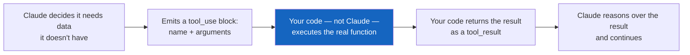
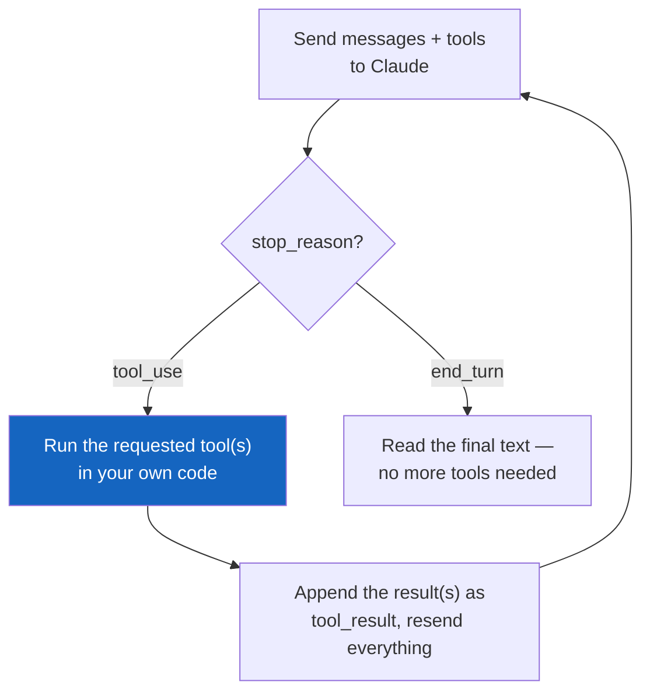
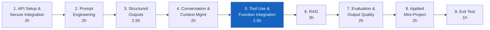
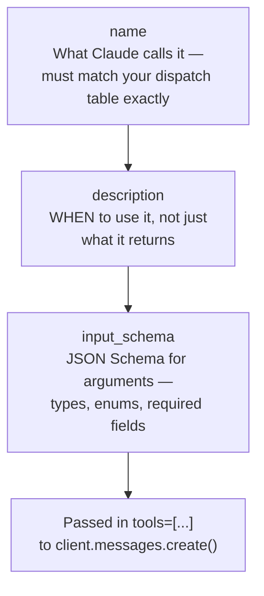
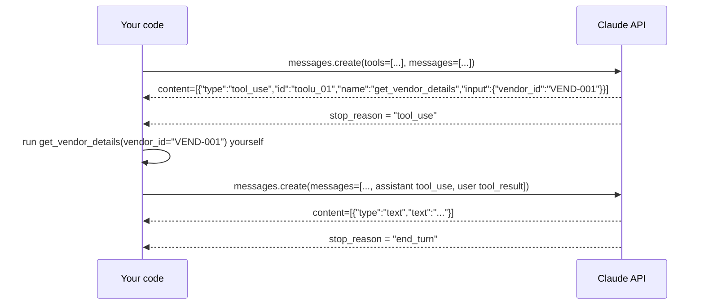
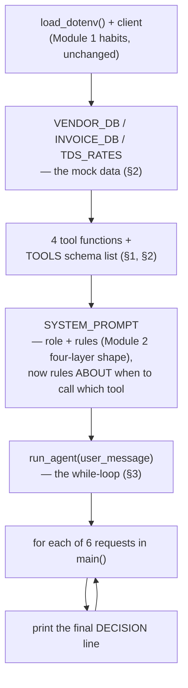
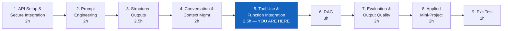

# Module 5 — Tool Use and Function Integration

**Course:** Building with Claude (StackRoute | RPS Consulting, an NIIT venture)
**Module duration:** 2.5 hours · **Audience:** Software/application developers, data engineers, solution architects
**Hands-on artifact:** `day3/invoice_tool_agent.py` · `day3/invoice_tool_agent_beta.py` · `day3/lab5.md`

> This guide is a self-paced companion to the live-connect session. It picks up right where
> [Module 4](module-04-conversation-and-context-management.md) left off — a `ConversationManager`
> that resends full message history every call — and walks through every Module 5 topic from the
> course design: **tool-use patterns, calculator/search/database tool examples, and business API
> integration.** The running example is Apex Bank's invoice-validation agent, which looks up
> invoices and vendors and calculates TDS instead of guessing at any of them.

---

## Table of contents

1. [Part A — From Remembering to Acting](#part-a--from-remembering-to-acting)
2. [Part B — Module 5: Tool Use and Function Integration](#part-b--module-5-tool-use-and-function-integration)
   1. [Tool-use patterns](#1-tool-use-patterns)
   2. [Calculator, search, and database examples](#2-calculator-search-and-database-examples)
   3. [Business API integration](#3-business-api-integration)
3. [Annotated walkthrough: `invoice_tool_agent.py`](#annotated-walkthrough-invoice_tool_agentpy)
4. [Common pitfalls](#common-pitfalls)
5. [Cheat sheet](#cheat-sheet)
6. [Where Module 5 fits in the course](#where-module-5-fits-in-the-course)

---

## Part A — From Remembering to Acting

### A.1 What Module 4 already gave you

Module 4 gave you a `ConversationManager` that resends the full `messages` history on every call,
watches token growth, and summarises when history gets too long. That solved *memory* — Claude
can refer back to what was said three turns ago. It did nothing for a different problem: Claude
still can't look anything up. Ask the Module 4 loan intake officer for today's applicant's actual
credit score and it can only repeat what the applicant already told it — it has no way to query
Apex Bank's own systems.

### A.2 Why tool use is engineering, not "give the model a function"

Tool use lets Claude request that *your code* run a function and hand the result back, before it
finishes answering. The engineering discipline is that Claude never executes anything itself — it
only ever emits a `tool_use` block naming a function and arguments; **your code decides whether to
actually run it, and controls everything the function is allowed to touch.**



This is the same "shape the request, validate the response" discipline from every earlier
module — applied here to a *function call* instead of a prompt or a schema. A tool's
`input_schema` is Module 3's Pydantic schema discipline pointed at Claude's *request*, not its
output; the loop that drives it is Module 4's growing `messages` list, now with `tool_use` and
`tool_result` blocks added into the turns.

### A.3 The agentic tool loop, at a glance

Every tool-use interaction in this module is one shape, repeated until Claude stops asking for
tools:



Nothing here is optional scaffolding — skip appending the assistant's `tool_use` turn, or send
back a mismatched `tool_use_id`, and the next call is rejected outright (you'll trigger this
deliberately in Lab 5, Part 2).

### A.4 Where Module 5 sits in the course



Module 6's RAG assistant is, mechanically, a search-style tool call over a vector store instead of
a mock database — everything you learn here about tool schemas, descriptions, and the agentic
loop carries forward unchanged. Module 7 then evaluates *tool correctness* — whether an agent
called the right tool with the right arguments — as one of its four grading dimensions.

---

## Part B — Module 5: Tool Use and Function Integration

**Course design table (verbatim scope for this module):**

> Tool-use patterns; calculator, search and database examples; business API integration.
> **Hands-on:** Design tool calls for invoice validation and vendor lookup.
> **Tools:** Claude tool use; OpenAPI integration.

**Implemented in this repo as:** an Apex Bank vendor-invoice validation agent
(`day3/invoice_tool_agent.py` + `day3/invoice_tool_agent_beta.py`, driven by
`shared/data/apex_bank_vendor_master.md` and `shared/data/apex_bank_invoices.md`) — the same
finance-domain hands-on the PDF names, built with four tools spanning the database/search/
calculator patterns from the topic list (see [§2](#2-calculator-search-and-database-examples)).

By the end of this module you can:

- [ ] Write a tool definition (`name`, `description`, `input_schema`) that reliably gets selected
      for the right situation and not for adjacent ones
- [ ] Distinguish a database-lookup tool, a search tool, and a calculator tool, and know when each
      shape fits
- [ ] Drive a full agentic tool loop by hand: append the assistant's `tool_use` turn, run the
      tool, return a correctly-shaped `tool_result`, and loop until `end_turn`
- [ ] Build the same agent with the higher-level beta `tool_runner()` and explain what it does and
      doesn't do for you
- [ ] Handle a tool-level failure (`is_error` / `ToolError`) without crashing the loop or hiding
      the failure from Claude

---

### 1. Tool-use patterns

A tool definition is a three-part contract you write once and Claude decides when to invoke:



**From `day3/invoice_tool_agent.py`:**

```python
{
    "name": "get_vendor_details",
    "description": "Fetch one vendor's master record (name, category, GSTIN, empanelment "
                    "status, empanelment expiry) by its exact vendor ID, e.g. 'VEND-001'.",
    "input_schema": {
        "type": "object",
        "properties": {
            "vendor_id": {"type": "string", "description": "Exact vendor ID"},
        },
        "required": ["vendor_id"],
    },
}
```

On the wire, offering tools changes both sides of the request/response anatomy you learned in
Module 1 §4 — a new `tools` parameter on the request, and a new content-block type and
`stop_reason` value on the response:



`stop_reason: "tool_use"` is the fourth value from Module 1's `stop_reason` table — the one every
Day 1–2 lab loop assumed away. From this module on, every agent's control flow branches on it.

> **See the shape click-by-click:** [`01-tool-schema-anatomy.html`](../labs/module-05/01-tool-schema-anatomy.html)
> lets you click through a tool definition's fields and watch a `tool_use` block and its matching
> `tool_result` get built piece by piece.

---

### 2. Calculator, search, and database examples

The course design names three example tool shapes. `day3/invoice_tool_agent.py` implements all
three so you can compare them directly rather than take the distinction on faith:

| Pattern | Tool in this lab | What makes it that pattern |
|---|---|---|
| **Database** | `get_invoice_details(invoice_id)`, `get_vendor_details(vendor_id)` | Exact-key lookup — one input maps to exactly one record or an error |
| **Search** | `search_invoices(vendor_name)` | Fuzzy/partial match — one input can map to zero, one, or many results |
| **Calculator** | `calculate_tds(amount_inr, category)` | Pure computation — no lookup at all, just deterministic math Claude shouldn't do itself |

```python
def get_vendor_details(vendor_id: str) -> dict:      # database — exact key
    vendor = VENDOR_DB.get(vendor_id)
    if vendor is None:
        return {"error": f"No vendor found with ID '{vendor_id}'"}
    return {"vendor_id": vendor_id, **vendor}

def search_invoices(vendor_name: str) -> dict:        # search — fuzzy match, N results
    needle = vendor_name.strip().lower()
    matches = [...]                                    # see the full function in the reference file
    return {"matches": matches} if matches else {"error": "..."}

def calculate_tds(amount_inr: float, category: str) -> dict:  # calculator — pure function
    rate = TDS_RATES.get(category)
    tds_amount = round(amount_inr * rate, 2)
    return {"tds_amount_inr": tds_amount, "net_payable_inr": round(amount_inr - tds_amount, 2)}
```

Why the calculator tool exists at all: an LLM predicts plausible-looking tokens, it doesn't run
arithmetic — `1250000 * 0.10` is exactly the kind of operation you hand to real code via a tool
rather than trust the model to compute correctly and consistently. The same reasoning extends to
anything with a single deterministic right answer: date math, unit conversion, totals.

**Why the description field decides tool selection, not the name:** `get_invoice_details` and
`search_invoices` both operate on the same `INVOICE_DB` — the only thing telling Claude which one
fits "I don't have the invoice ID, only the vendor name" is the wording of each `description`.
Lab 5 Part 1 has you point to the exact phrase in each description that disambiguates them.

> **Compare all three side by side:** `labs/module-05/demos/01-tool-schema-design/` runs the same
> three tool shapes offline (`--simulate`, no API key needed) so you can inspect each
> `input_schema` and a hand-built `tool_use`/`tool_result` pair without spending a call.

---

### 3. Business API integration

The hands-on task — validating a real invoice against a real vendor master — needs *multiple*
tool calls chained together and a final decision that depends on every result, not just the first
one. That chaining is the agentic loop from [Part A.3](#a3-the-agentic-tool-loop-at-a-glance),
written two ways in this lab.

**Manual loop — you own every step (`invoice_tool_agent.py`):**

```python
while True:
    response = client.messages.create(
        model=MODEL, max_tokens=1024, system=SYSTEM_PROMPT, tools=TOOLS, messages=messages,
    )
    messages.append({"role": "assistant", "content": response.content})   # full content list

    if response.stop_reason != "tool_use":
        break                                                              # loop until end_turn

    tool_results = []
    for block in response.content:
        if block.type != "tool_use":
            continue
        result = TOOL_FUNCTIONS[block.name](**block.input)
        tool_results.append({
            "type": "tool_result", "tool_use_id": block.id,
            "content": json.dumps(result), "is_error": "error" in result,
        })
    messages.append({"role": "user", "content": tool_results})            # one message, all results
```

**Beta `tool_runner()` — the runner owns the loop (`invoice_tool_agent_beta.py`):**

```python
@beta_tool
def calculate_tds(amount_inr: float, category: str) -> str:
    """Calculate the TDS amount and net payable for an invoice.

    Args:
        amount_inr: Invoice amount in INR.
        category: Vendor's payment category.
    """
    ...
    return json.dumps({...})          # str / content blocks required — not a raw dict

result = client.beta.messages.tool_runner(
    model=MODEL, max_tokens=1024, system=SYSTEM_PROMPT, tools=TOOLS,
    messages=[{"role": "user", "content": user_message}],
).until_done()
```

| | Manual loop | Beta `tool_runner()` |
|---|---|---|
| Schema | Hand-written `input_schema` dict | Inferred from type hints + docstring |
| Loop | You write the `while` loop yourself | Runner drives it; `.until_done()` returns the final message |
| Tool failure | Return `{"error": ...}`, set `is_error` yourself | `raise ToolError(...)`; runner sets `is_error` |
| Tool return value | Any JSON-serialisable value, you call `json.dumps()` at the call site | Must return `str` or content blocks — `json.dumps()` inside the tool itself |
| When to reach for it | Learning the mechanics; need custom control over each iteration (logging, partial results, mixing tool calls with non-tool logic) | Production code where the loop shape is standard and you want less boilerplate |

Both versions are taught side by side deliberately — see the manual loop's control flow once and
the beta runner stops looking like magic; it's the same loop with the bookkeeping moved inside the
SDK.

> **Watch the two loops run in parallel:** [`02-agentic-loop-trace.html`](../labs/module-05/02-agentic-loop-trace.html)
> steps through one invoice's full tool-call sequence turn by turn.
> [`03-manual-vs-tool-runner.html`](../labs/module-05/03-manual-vs-tool-runner.html) lets you
> toggle a tool failure on/off and see exactly where each style's error handling kicks in.
> `labs/module-05/demos/02-manual-agentic-loop/` and `demos/03-tool-runner-beta/` run the real
> versions against the live API.

---

## Annotated walkthrough: `invoice_tool_agent.py`



`SYSTEM_PROMPT` reuses Module 2's role/constraints/format layering, but the constraints now name
*tools* ("Always call get_invoice_details ... before reasoning") instead of a source document, and
the format rule fixes an exact `DECISION: APPROVE | HOLD - <reason>` string — the same
"objectively checkable" discipline from Module 2 §4, now checked against a tool-derived fact
instead of a document.

Run it yourself:

```bash
cd day3
python invoice_tool_agent.py        # manual loop
python invoice_tool_agent_beta.py   # beta tool_runner — same 6 requests, same answers
```

Expect six invoice reviews. `INV-2026-0101` approves cleanly; the other four each hold for a
different reason — GSTIN mismatch, expired empanelment, an unapproved vendor, and an amount over
the sign-off threshold — and the sixth request forces a `search_invoices` call before the agent
has an invoice ID to work with at all.

---

## Common pitfalls

| Pitfall | Symptom | Fix |
|---|---|---|
| Appending `response.content[0].text` instead of the full `response.content` | Next call fails or Claude "forgets" it just asked for a tool | Always append the full content list — `tool_use` blocks live alongside any text blocks |
| Breaking the loop as soon as `stop_reason == "tool_use"` | Tool results never get sent back; the agent looks like it "gives up" mid-task | Loop *through* `tool_use`, break only on `end_turn` (or loop `while stop_reason != "end_turn"`) |
| `tool_use_id` on the result doesn't match the `id` on the `tool_use` block | `400 invalid_request_error` — the API rejects the whole message | Read `block.id` off the same block you're responding to, in the same iteration |
| Returning a raw `dict` from a `@beta_tool`-decorated function | `400` error: "tool_result content must either be a string or a list of content blocks" | `return json.dumps(result)` — the beta runner does not serialize dicts for you |
| Vague tool `description` ("gets vendor info") | Claude calls the wrong tool, or the right tool with guessed arguments | State exactly when to use the tool and what its arguments mean, the same discipline as Module 2's constraint wording |
| Silently swallowing a tool-level failure (returning `None`, printing and continuing) | Claude reasons over a missing/`None` result as if it were valid data | Return `{"error": "..."}` with `is_error: True` (manual) or `raise ToolError(...)` (beta) — let Claude see the failure and react |
| Testing only the one-tool-one-call happy path | Multi-tool turns, or "no ID, only a name" phrasing, break silently in production | Test at least one case needing 2+ chained tool calls and one needing `search` instead of an exact ID (Lab 5 Part 4) |

---

## Cheat sheet

```python
# ── Tool definition (manual style) ──────────────────────────────────────
TOOLS = [{
    "name": "get_vendor_details",
    "description": "Fetch a vendor record by its exact ID. Use this when you already "
                    "have a vendor_id.",           # WHEN to use it, not just what it returns
    "input_schema": {
        "type": "object",
        "properties": {"vendor_id": {"type": "string"}},
        "required": ["vendor_id"],
    },
}]
TOOL_FUNCTIONS = {"get_vendor_details": get_vendor_details}

# ── Manual agentic loop ─────────────────────────────────────────────────
messages: list[dict] = [{"role": "user", "content": user_message}]
while True:
    response = client.messages.create(
        model=MODEL, max_tokens=1024, system=SYSTEM_PROMPT, tools=TOOLS, messages=messages,
    )
    messages.append({"role": "assistant", "content": response.content})  # FULL content list
    if response.stop_reason != "tool_use":
        break
    tool_results = []
    for block in response.content:
        if block.type != "tool_use":
            continue
        result = TOOL_FUNCTIONS[block.name](**block.input)
        tool_results.append({
            "type": "tool_result", "tool_use_id": block.id,
            "content": json.dumps(result), "is_error": "error" in result,
        })
    messages.append({"role": "user", "content": tool_results})           # ONE message, all results

# ── Beta tool_runner ─────────────────────────────────────────────────────
from anthropic.lib.tools import ToolError, beta_tool

@beta_tool
def get_vendor_details(vendor_id: str) -> str:
    """Fetch a vendor record by its exact ID.

    Args:
        vendor_id: Exact vendor ID.
    """
    vendor = VENDOR_DB.get(vendor_id)
    if vendor is None:
        raise ToolError(f"No vendor found with ID '{vendor_id}'")
    return json.dumps({"vendor_id": vendor_id, **vendor})   # str, not dict

result = client.beta.messages.tool_runner(
    model=MODEL, max_tokens=1024, system=SYSTEM_PROMPT,
    tools=[get_vendor_details], messages=[{"role": "user", "content": user_message}],
).until_done()
answer = next((b.text for b in result.content if b.type == "text"), "")
```

---

## Where Module 5 fits in the course



| Module | Case study | Folder |
|---|---|---|
| 1. API Setup and Secure Integration | Secure, env-managed Claude call | `day1/` (`secure_call.py`, `lab1.md`) |
| 2. Prompt Engineering for Applications | Finance credit-policy explainer | `day1/` (`credit_policy_assistant.py`, `lab2.md`) |
| 3. Structured Outputs and Validation | Apex Bank loan-application data extraction | `day2/` (`loan_application_extractor.py`, `lab3.md`) |
| 4. Conversation and Context Management | Apex Bank loan intake conversation manager | `day2/` (`loan_intake_manager.py`, `lab4.md`) |
| 5. Tool Use and Function Integration | Apex Bank invoice validation + vendor lookup | `day3/` (`invoice_tool_agent.py`, `invoice_tool_agent_beta.py`, `lab5.md`) |
| 6. Retrieval-Grounded Responses (RAG) | Finance SOP assistant | `day3/` – `day4/` |
| 7. Evaluation and Output Quality | Evaluate the RAG assistant | `day4/` – `day5/` |
| 8. Applied Mini-Project | Telecom support triage assistant | `day5/` |
| 9. Exit Test | Scenario assessment | — |

> Row 5 is the first row confirmed against real files in `day3/` — rows 6–8 still describe
> `day3/`–`day5/` content that doesn't exist yet in this repo, the same caveat the
> [Module 1](module-01-api-setup-and-secure-integration.md#where-module-1-fits-in-the-course) and
> [Module 2](module-02-prompt-engineering-for-applications.md#where-module-2-fits-in-the-course)
> guides flag — worth double-checking again once those folders are built.

**Reference material:** [`module-04-conversation-and-context-management.md`](module-04-conversation-and-context-management.md)
(the pipe this module fills) · [`SETUP.md`](../SETUP.md) (environment setup) ·
[`shared/data/apex_bank_vendor_master.md`](../shared/data/apex_bank_vendor_master.md) and
[`shared/data/apex_bank_invoices.md`](../shared/data/apex_bank_invoices.md) (this module's source
data) · [`day3/lab5.md`](../day3/lab5.md) (this module's graded lab) ·
[`day3/invoice_tool_agent.py`](../day3/invoice_tool_agent.py) and
[`day3/invoice_tool_agent_beta.py`](../day3/invoice_tool_agent_beta.py) (reference
implementations) · [`labs/module-05/demos/`](../labs/module-05/demos/) (three standalone demos) ·
interactive visualizations:
[tool schema anatomy](../labs/module-05/01-tool-schema-anatomy.html) ·
[agentic loop trace](../labs/module-05/02-agentic-loop-trace.html) ·
[manual vs. tool runner](../labs/module-05/03-manual-vs-tool-runner.html).
